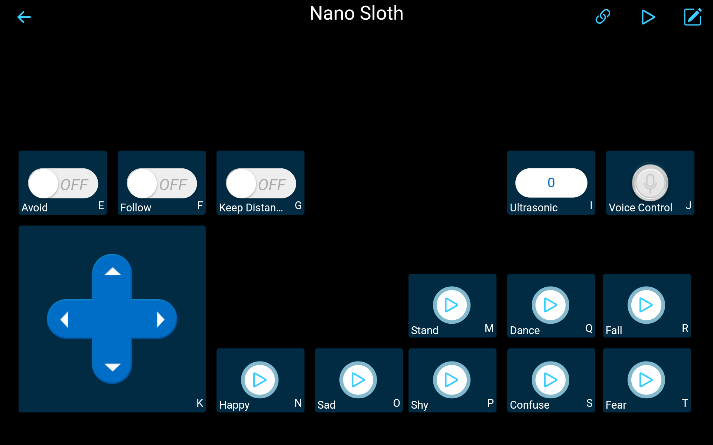

# Nano Sloth APP Control with APP Sunfounder Controller

This is the program for Ardunio Nano. The upper machine esp01s (or other) establishes websockets service to communicate with APP Sunfounder Controller, and returns data from the serial port to Nano, so as to complete the remote control of the robot Sloth.

## Related Links

- esp01s firmware:
    https://github.com/sunfounder/esp8266-uart-wsserver
- Sunfounder Controller:
    https://docs.sunfounder.com/projects/sf-controller/en/latest/index.html
- our website:
    https://sunfounder.com
- our documentation:
    https://docs.sunfounder.com/en/latest/

## Dependent Libraries

- ArduinoJson
    https://arduinojson.org/?utm_source=meta&utm_medium=library.properties
- NewPing
    https://bitbucket.org/teckel12/arduino-new-ping/wiki/Home

## App Controls Layout

    </img>

## Project Tree
    Nano_Sloth_App_Control
    ├─ Nano_Sloth_App_Control.ino     // main file
    ├─ servos_control.cpp             // servos control
    ├─ servos_control.h               // servos driver and action arrays
    ├─ ultrasonic.cpp                 //  ultrasonic
    ├─ ultrasonic.h
    ├─ VarSpeedServo.cpp              // servos underlying driver
    ├─ VarSpeedServo.h
    ├─ voice_control.h                // voice control functions and command list
    ├─ ws.cpp                         // websocket uart serial data reading and processing
    ├─ ws.h
    └─README.md

## Contact us
website:
    <a href="https://www.sunfounder.com" target="_blank">www.sunfounder.com</a>

E-mail:
    service@sunfounder.com