Assembly
========

**Head Assembly**

Insert the ultrasonic module into No. 1 board and secure it with M1.4*8 screws and M1.4 nuts.

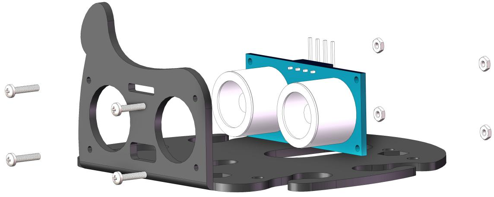

Use a M3*5 screw to secure the M3*8 Bi-pass Copper Standoff post on No. 1 board.

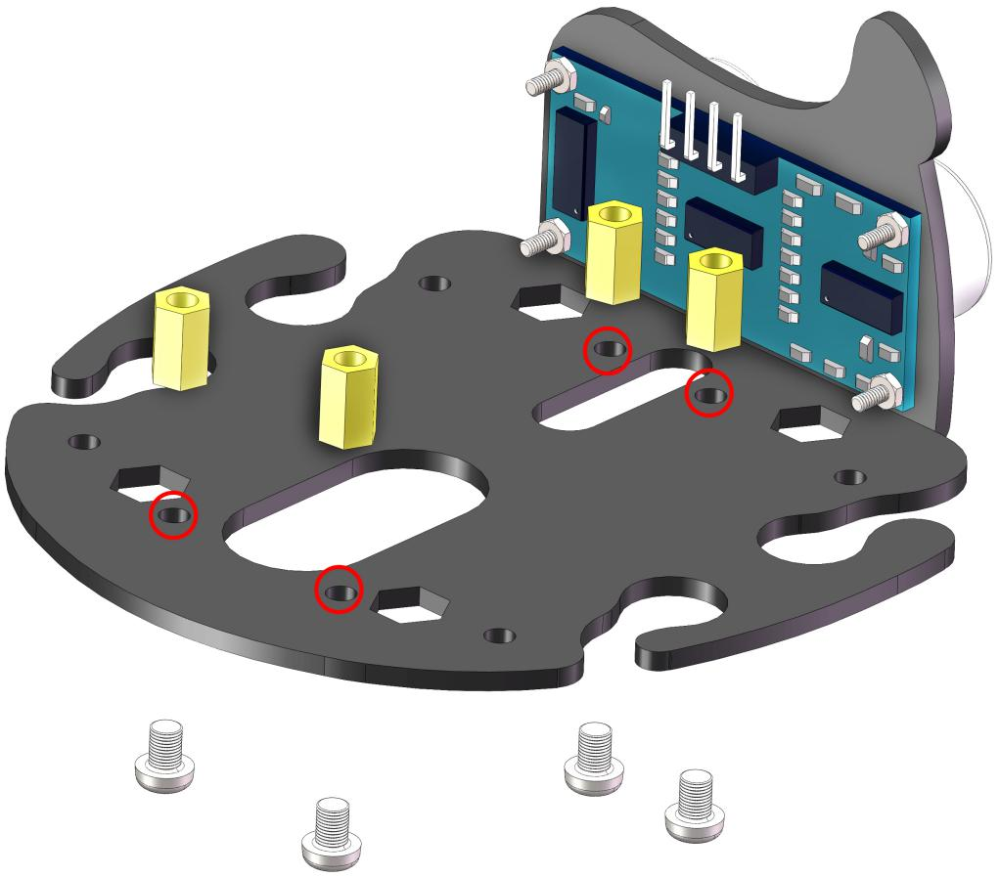

**Electrical Module Assembly**

Use a M3*5mm screw to mount the previously installed circuit board on No. 1 board.

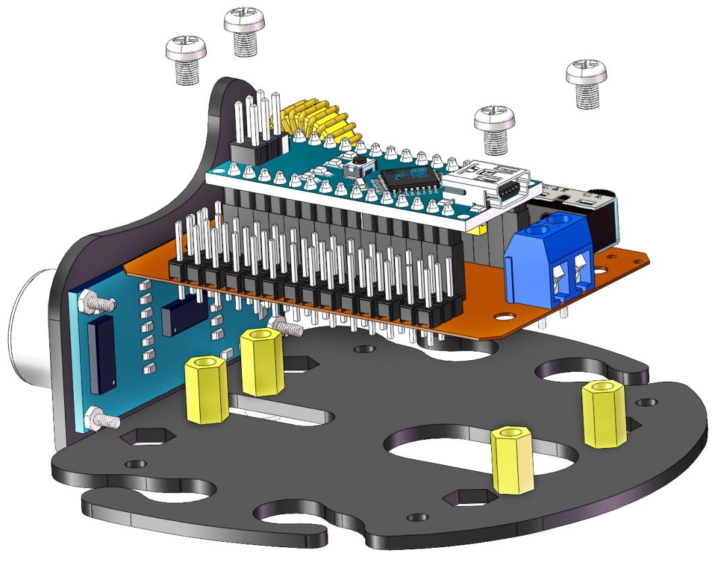

Use M3*5 screws to fix M3*25 Bi-pass Copper Standoff under the No. 1 board.

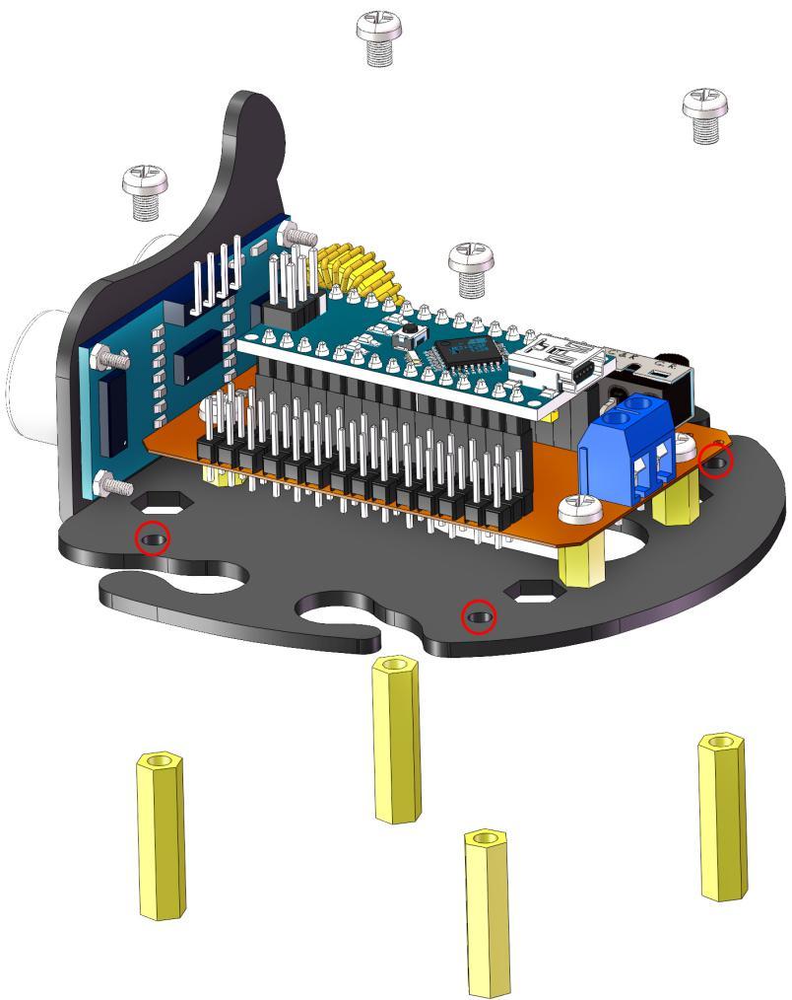

**Servo Assembly**

Use M2*8 screws and M2 nuts to mount the servo on the corresponding position on the No. 2 board. 
(Note the direction of the servo installation)

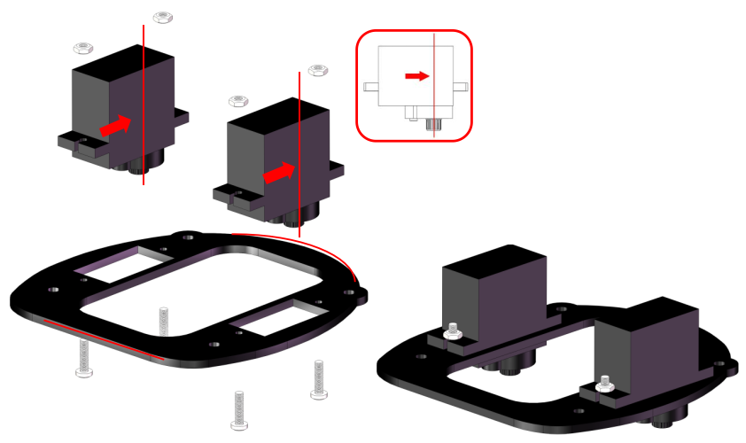

Secure the No. 1 and No. 2 boards with M3*5 screws. Note that the side of the servo shaft should be mounted on the side of the USB port. 

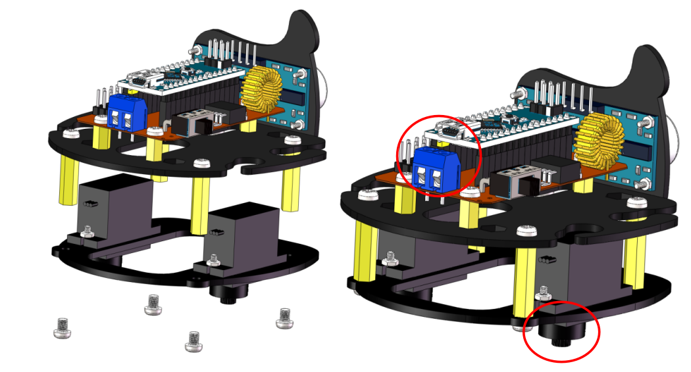

Use two M1.5*5 self-tapping screws to fix the 2-arm rocker arm to the No. 4 board and use the same method to install another No. 4 board. 

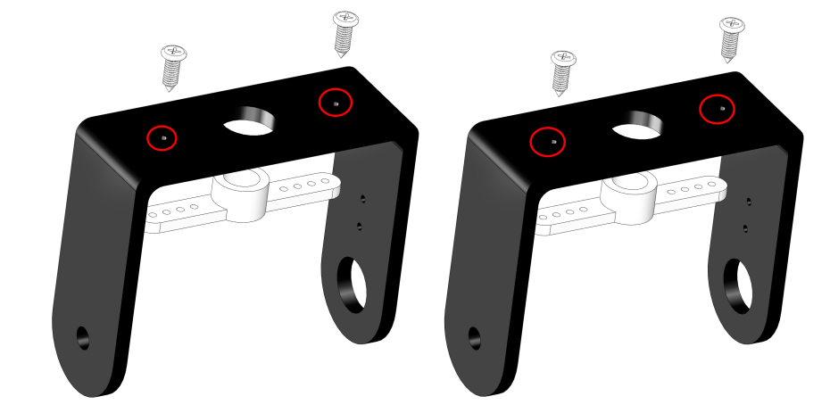

Secure one of the round holes on the 4th and 5th boards with M3*8 Countersunk screws and M3 self-locking nuts.

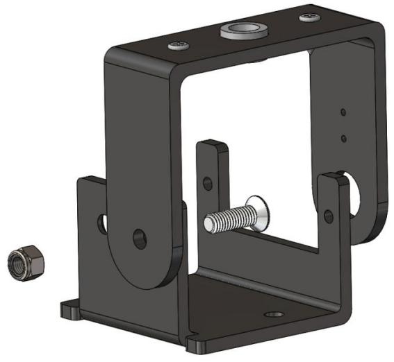

Use the same method to secure the other round hole on the 4th and 5th boards, as shown in the following figure:

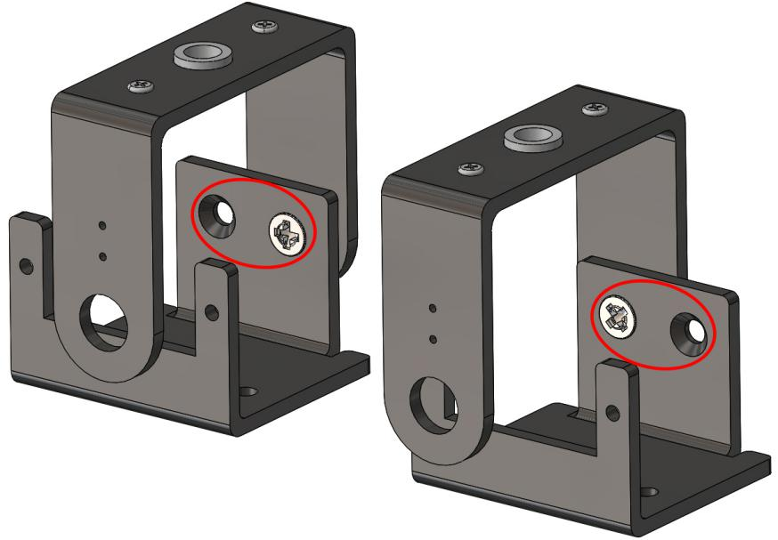

Use two M1.5*5 self-tapping screws to secure the 1-arm rocker arm on the No.4 board. 

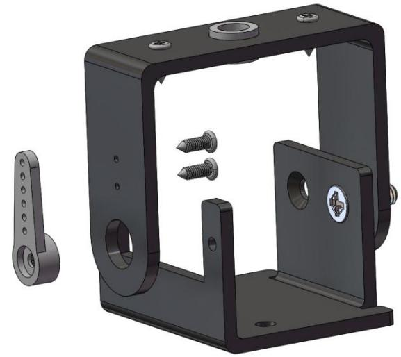

Install another No.4 board in the same way.

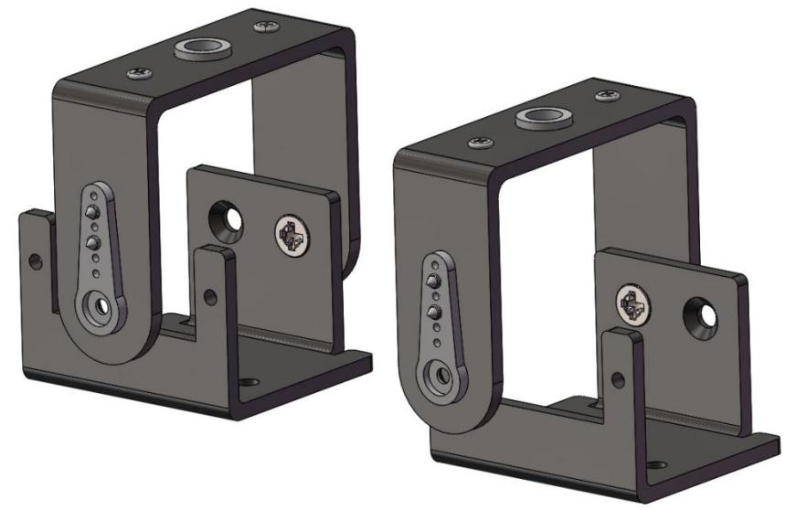

Turn the No. 6 board with the countersunk side down and secure the No. 6 board to the right leg described above with the M3*8 countersunk screw and the M3 self-locking nut. 

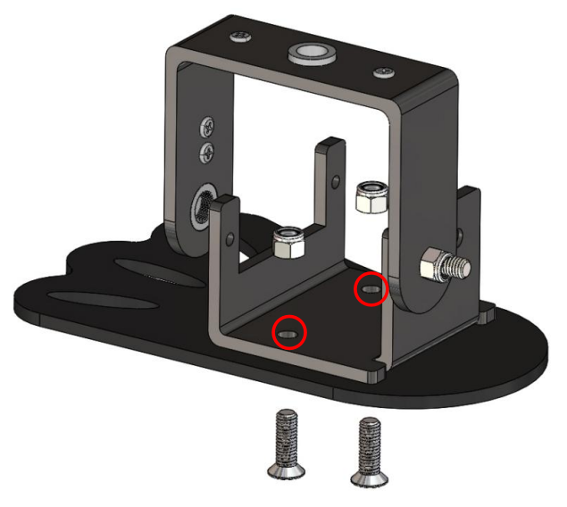

The same method can be used to secure the No.7 and the left leg. Observe the picture carefully. The left and right feet you have installed need to be exactly the same as that in the picture. Otherwise, the robot won't walk properly.

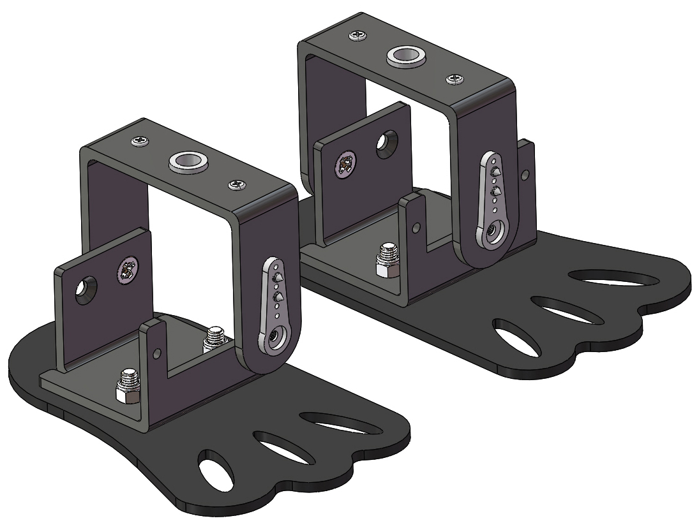

**Servo INSTALL Test**

.. warning:: 

    Due to an unfortunate manufacturing error, the polarity of some battery connectors has been reversed, which may cause overheating when using 9V battery.

    To prevent any safety risks or damage to the product, please carefully check the polarity of the battery connectors before inserting a 9V battery.
    
    .. image:: img/wire_warning.png    

    If you find that the battery connector is reversed, please do not attempt to complete the installation. Instead, please contact our customer support team. We will replace it for you as soon as possible.

    Email: cs@sunfounder.com

Connect the 4 servos to pin 9, 10, 11 and 12 respectively again. This is designed to keep the servo angle of the upload code at 90°(internal angle) before the servo shaft is installed, in order to let the Sloth remain upright after assembly.

.. image:: img/assembly_14.png

Open the program ``simple_robot.ino`` under 
the path of ``DIY_4-DOF_Robot_Kit_-_Sloth\Code\simple_robot``. 
After opening, you can see the other 2 files: ``VarSpeedServo.cpp`` and ``VarSpeedServo.h`` are opened at the same time. 
This two files are set to adjust the angle of the servo.

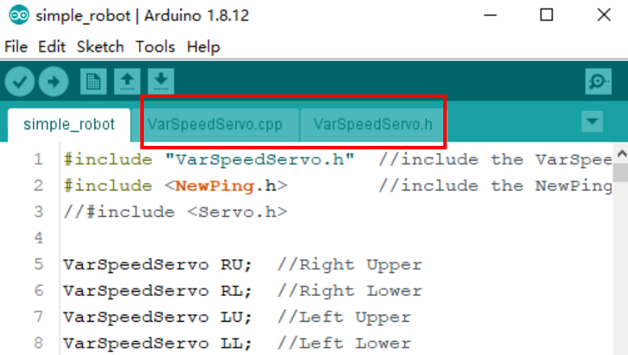

There are three ``#define`` statements in line 39-41. Removing the respective comment signs ``//`` enables you to start their functions as shown.

* #define INSTALL: Start the INSTALL mode, in which 4 servos will be fixed at 90°for assembly.
* #define CALIBRATION: Start the calibration mode, in which the angles of 4 servos can be adjusted.
* #define RUN: Start the RUN mode, in which the robot can go ahead and get round if it meets obstacles. 

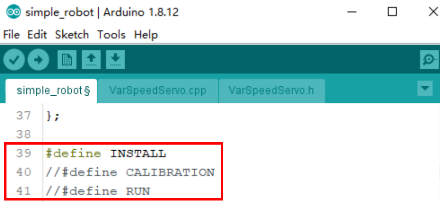

.. note:: Only one function can be used at the same time. Starting multiple functions might break down the robot. 

In the current step, use INSTALL mode. Then select the corresponding Board, Processor and Port. The code is then uploaded into the SunFounder Nano board. Don't forget to toggle the power switch to ON. When the servo control board is powered on, the servo will rotate to the position specified by the program. 

**Foot Assembly**

.. note:: Keep on the power until the whole step.

Assemble the left leg with the smallest screws in the packaged with servo, a gasket plate is needed between the servo and left leg. Try to keep the edges of the 4th board and the servo parallel to each other. If deviation are found at installation, it is normal and we will adjust them later when calibrating.

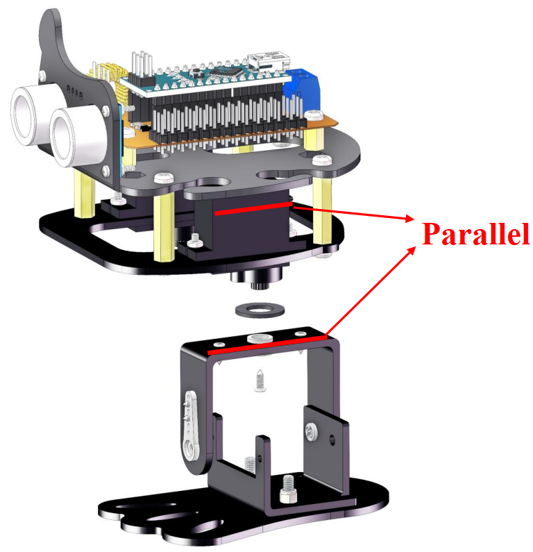

Insert a servo (in working condition) into the servo shaft of the left foot. 
Besides 2 M2*8 screws and 2 M2 nuts, 
a gasket plate is needed between the servo and left leg.

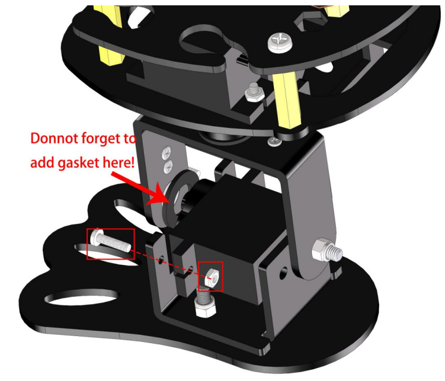

Assemble the right leg in the same way. 

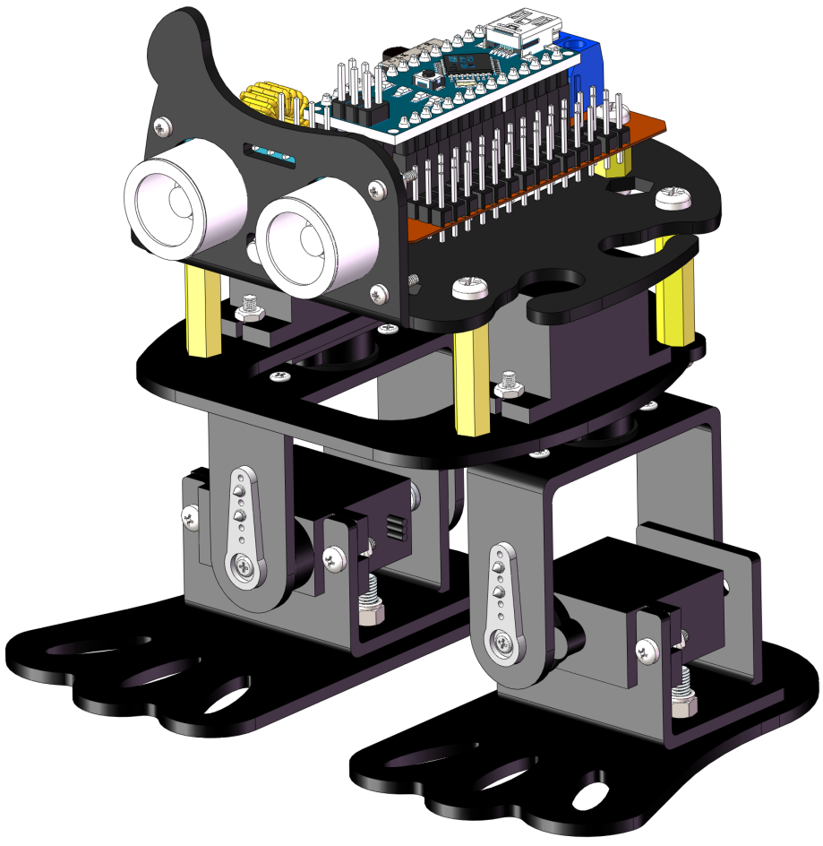

Secure the 2 legs with the smallest screws in the packaged with servo. 

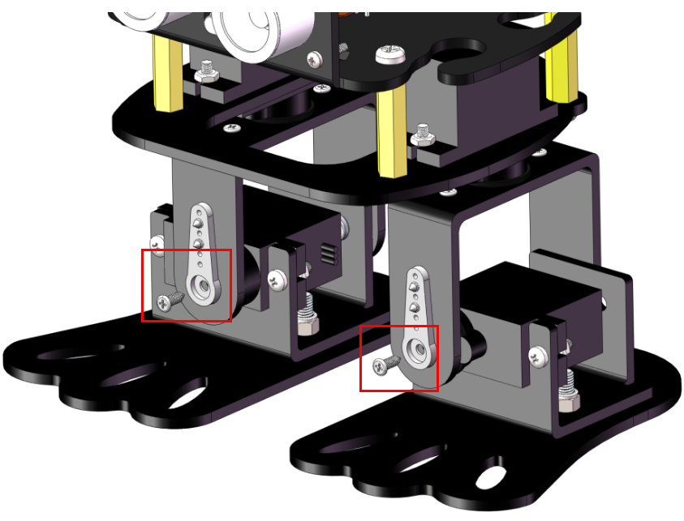

**Battery Assembly** 

Attach one side of velcro tape to the bottom of the No. 1 board and the other side to the battery. 

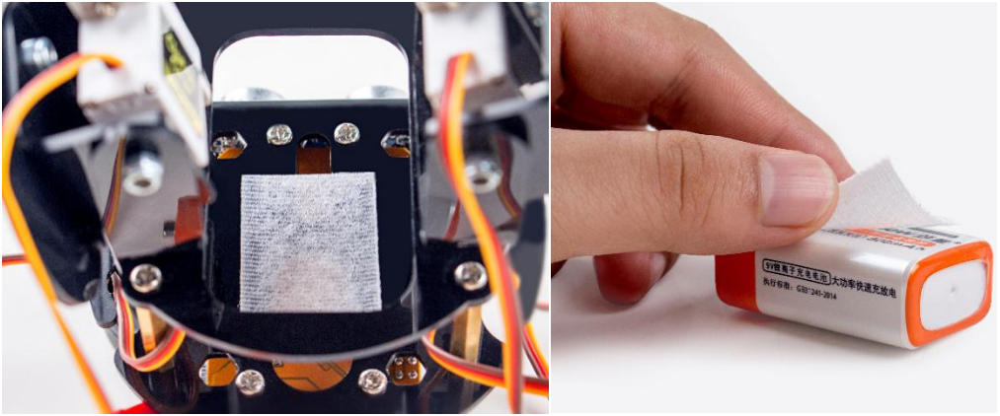

Insert the battery into the battery cable and plug the other end into the expansion board.

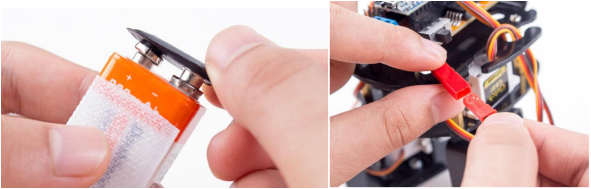

Lastly, paste the battery on the No. 1 board.

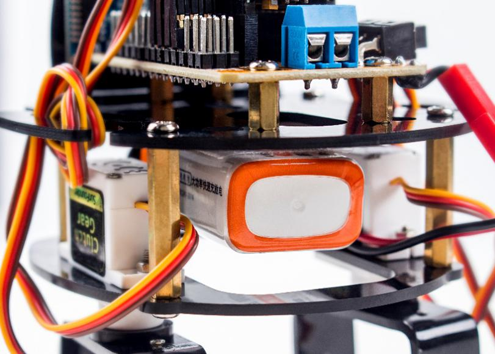

**Servo CALIBRATION Test**

Check the assembly of the 4 servos according to the picture as shown.

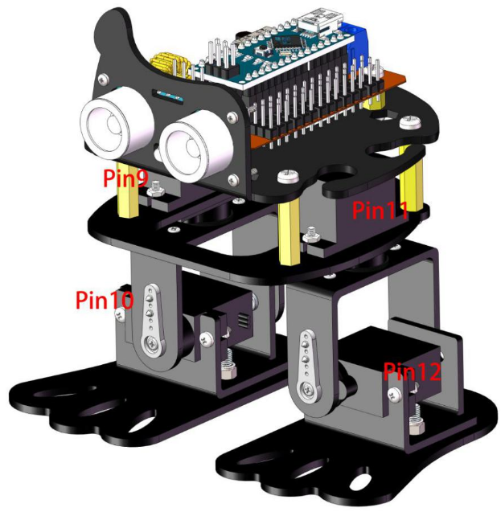

Open the program ``simple_robot.ino`` and go to Line 39. 
Set ``#define CALIBRATION`` as able and disable the other two. 
Then select the correct board and port, and upload the sketch. 

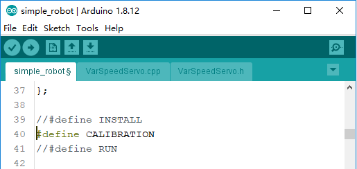

If the robot is not fully upright, the angle can be manually calibrated. Go to Line 15 to rectify it.

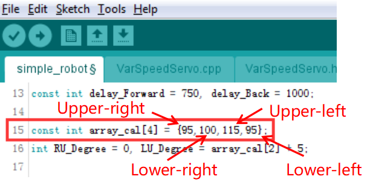

The basic principle of calibration: 
increased values can rotate the servo shaft clockwise and vice versa. 
For example, if the right leg is toe out, 
you need to decrease the upper-right servo’s angle; 
if it is toe in, you need to increase the angle.

Tips for calibration:
#. The calibration method for the left leg works the opposite way for right leg.
#. If the right foot’s sole faces outward, you need to decrease the lower-right servo’s angle; if its sole faces inward, you need to increase the angle.
#. The calibration method for the left foot works the opposite way for right foot.

**Ultrasonic Connecting**

Connect pin TRIG of the ultrasonic to pin 4 of the board, ECHO to pin 3, VCC to VCC and GND to GND. 

.. image:: img/assembly_27.png

**Wire Arrangement**

Twine the servo wire and 4-Pin anti-reverse cable on the No. 1 board.

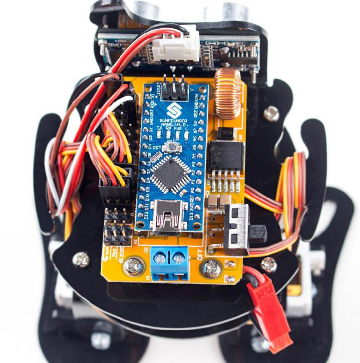

So far the robot has been assembled successfully, it’s easy if you follow our steps closely. Hope you enjoy the fun of the bot, thanks for watching.