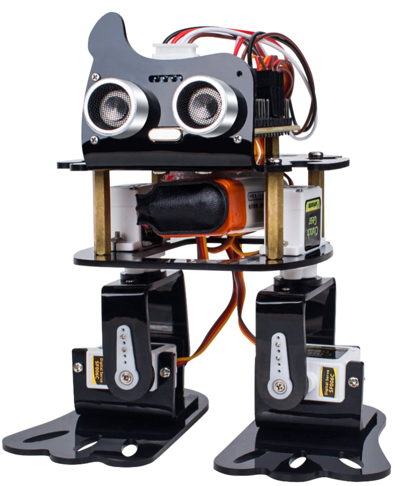

Sloth - SunFounder DIY 4-DOF Robot Kit 
=======================================

This cute learning kit focuses on the popular open source platform Arduino. 
You can learn the knowledge of the Arduino servo and ultrasonic ranging module by applying this kit.

It is a new mobile robot called Sloth developed by SunFounder. 
Each leg has 2 joints driven by servo. 
One 9V chargeable lithium batteries are to supply the bot when the SunFounder Nano is used as the control board, compatible with the Arduino Nano. 
A servo control board connects with the batteries, servos, SunFounder Nano, 
and the HC-SR04 ultrasonic ranging module. 
Sloth can move forward and detect the range to make a turn when encountering an obstacle. In addition, when learning to program, you can also have the fun to build a pretty cool bio-robot by yourself.

.. toctree::
   :maxdepth: 2 
   :caption: Contents:

   component
   download_the_code
   install_arduino
   test_module
   assembly
   example
   q&a

Summary
-------

In this manual, having learned the related components for building the robot kit, you’ve gone through the assembly of the mechanical parts and electrical modules with the knowledge of Arduino as well as a brief introduction of the key parts like servo, ultrasonic, etc. Also you’ve got a lot of software and coding, which lays a solid foundation for your futrue journey of exloring open-source field.

The SunFounder DIY 4-DOF Robot Kit is not only a toy, but more a meaningful development kit for Arduino. After all the study and hands-on practice of the kit, you should have a better understanding of Aduino. Now, get started to make better work!

Copyright Notice
----------------

All contents including but not limited to texts, images, and code in this manual are owned by the SunFounder Company. You should only use it for personal study, investigation, enjoyment, or other non-commercial or nonprofit purposes, under the related regulations and copyrights laws, without infringing the legal rights of the author and relevant right holders. For any individual or organization that uses these for commercial profit without permission, the Company reserves the right to take legal action.

