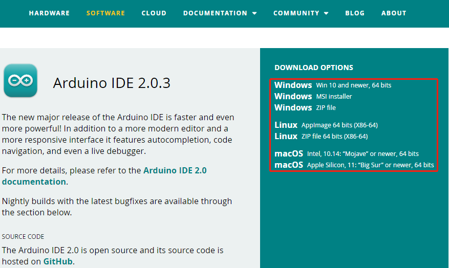
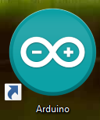
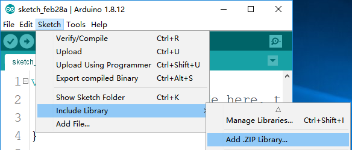
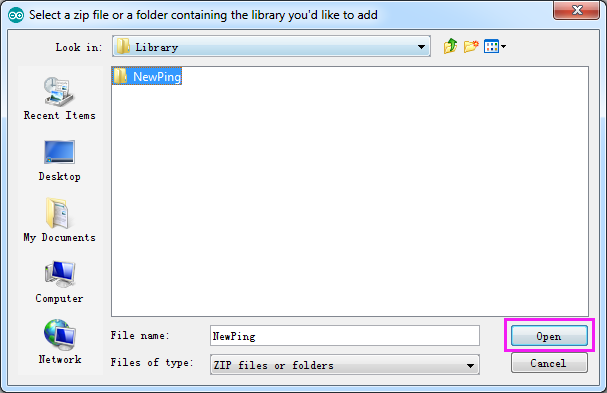
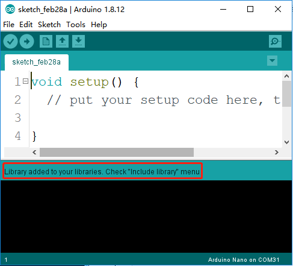

Install Arduino IDE and Add Libraries
=====================================

**Arduino**

Arduino is an open source platform that applies simple software and hardware. 
You can get it in a short even when you know little of it. 
It provides an integrated development environment (IDE) for code editing and compiling, 
compatible with multiple control boards. So you can just download the Arduino IDE, 
upload the sketches (i.e. the code files) to the board, 
and then you can see experimental phenomena. 
For more information, refer to https://www.arduino.cc/. 

**Install Arduino IDE**

The code in this kit is written based on Arduino, 
so you need to install the IDE first. Skip it if you have done this.
Now go to the Arduino website: https://www.arduino.cc/, 
find the one that suits your operation system and click to download.

There are two versions of Arduino for Windows: Installer or ZIP file. You're recommended to download the former. Just download the package, and run the executable file to start installation. It will download the driver needed to run Arduino IDE. After downloading, follow the prompts to install. 
After installing, you will see Arduino icon on your desk and double click to open it. 

**Add Libraries**

You will get the following error when trying to run the code that contains the ultrasonic module: 

`NewPing.h: no such file or directory`

Therefore, it needs to be manually added. Here are the steps.
Open Arduino IDE, **select Sketch -> Included Library -> Add .ZIP Library**.

Enter the path **DIY_4-DOF_Robot_Kit_-_Sloth\Library**  and select to open NewPing.

Then you will see “Library added to your libraries”, indicating the library has been included successfully.

