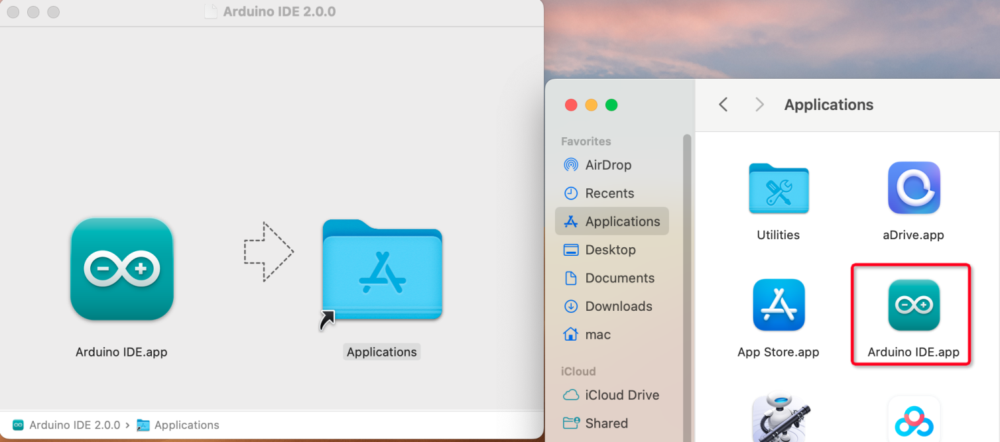

Install Arduino IDE and Add Libraries
=====================================

The Arduino IDE, known as Arduino Integrated Development Environment, provides all the software support needed to complete an Arduino project. It is a programming software specifically designed for Arduino, provided by the Arduino team, that allows us to write programs and upload them to the Arduino board.
The Arduino IDE 2.0 is an open-source project. It is a big step from its sturdy predecessor, Arduino IDE 1.x, and comes with revamped UI, improved board & library manager, debugger, auto complete feature and much more.
In this tutorial, we will show how to download and install the Arduino IDE 2.0 on your Windows, Mac, or Linux computer.

Download Arduino IDE
---------------------------

The code in this kit is written based on Arduino, so you need to install the IDE first. Skip it if you have done this.
Now go to the Arduino website: https://www.arduino.cc/en/software, find the one that suits your operation system and click to download.

.. image:: img/install_arduino_1.png

Installation
------------------
* Windows - Win 10 and newer, 64 bits
* Linux - 64 bits
* Mac OS X - Version 10.14: “Mojave” or newer, 64 bits

Windows
^^^^^^^^^^^^^^^

#. Double click the ``arduino-ide_xxxx.exe`` file to run the downloaded file. Read the License Agreement and agree it.

    .. image:: img/install_ide_windows1.png
        :align: center

#. Choose installation options.

    .. image:: img/install_ide_windows2.png
        :align: center

#. Choose install location. It is recommended that the software be installed on a drive other than the system drive.

    .. image:: img/install_ide_windows3.png
        :align: center

#. Then Finish.

    .. image:: img/install_ide_windows4.png
        :align: center

Mac OS X
^^^^^^^^^^

Double click on the downloaded ``arduino_ide_xxxx.dmg`` file and follow the instructions to copy the Arduino IDE.app to the **Applications** folder, you will see the Arduino IDE installed successfully after a few seconds.

Linux
^^^^^^^^^^

For the tutorial on installing the Arduino IDE 2.0 on a Linux system, please refer to: 
https://docs.arduino.cc/software/ide-v2/tutorials/getting-started/ide-v2-downloading-and-installing#linux

Open the IDE
------------------

When you first open Arduino IDE 2.0, it automatically installs the Arduino AVR Boards, built-in libraries, and other required files.

.. image:: img/open_ide.png
    :align: center

In addition, your firewall or security center may pop up a few times asking you if you want to install some device driver. Please install all of them.

.. image:: img/install_driver.png
    :align: center

Now your Arduino IDE is ready!

.. note::
    In the event that some installations didn’t work due to network issues or other reasons, you can reopen the Arduino IDE and it will finish the rest of the installation. 

Add Libraries
------------------

You will get the following error when trying to run the code that contains the ultrasonic module: 
    
    NewPing.h: no such file or directory

Therefore, it needs to be manually added. Here are the steps.
Open the Arduino IDE, click on the **Library Manager** icon to open it, search for ``newping`` and click on **INSTALL** in the options that appear. Wait for the prompt to complete the installation and you're done!

.. image:: img/install_library.png
    :align: center