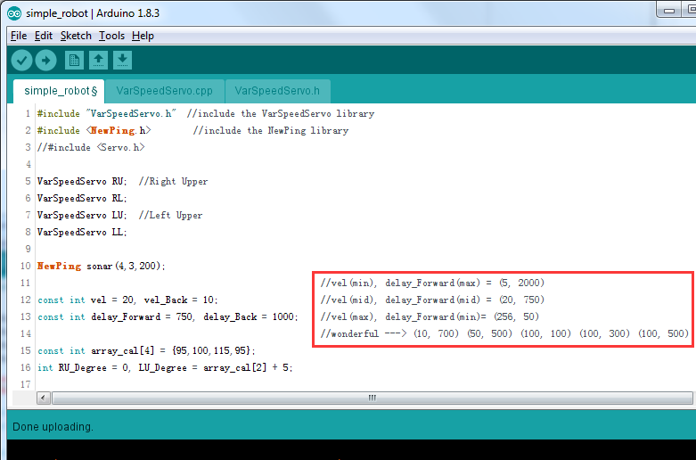

Q&A
=====

**Q1: How can we know the servo is damaged?**

    In Servo Test step, if the servo rocker arm shake, get stuck or can not rotate smoothly, with an abnormal sound, we can judge it as a damaged one. 

**Q2: Why the Sloth reboots in running?**

#. If the Sloth is in lower power, rebooting will happen, please charge the battery in time.

#. It could be the servos are lacking for power. Open the program and go to Line 12, 13. ``vel`` is the servos rotating speed in initialization or moving forward; ``vel_Back`` is the servos rotating speed in moving backward; ``delay_Forward``, ``delay_Back`` are the delays between two moving forward loops and moving backward loops.

    * If rebooting happens in moving forward actions, you can decrease the value of ``vel`` and increase the value of ``delay_Forward``. For example, decrease ``vel`` value to 10, and increase ``delay_Forward`` to 1500.

    * If rebooting happens in moving backward actions, you can decrease ``vel_Back`` and increase ``delay_Backward``. For instance, decrease ``vel_Back`` to 8, and increase ``delay_Backward`` to 1500. You can adjust to a proper value as you want. Then click Upload.

    .. image:: img/qa1.png

**Q3: Sloth walks too slowly when it moves forward. How to solve this?**

A3: Sloth’s default speed is middle speed, the related sketch is ``vel(mid), delay_Forward(mid) = (20, 750)``. You can change the speed value as shown below to adjust the walking speed.

change the value of ``vel`` and ``delay_Forward`` in line12 and 13 to as shown:

.. code-block::

    vel = 50, delay_Forward = 500

Then click Upload. 

.. note:: If you adjust the robot to a high walking speed, it may fall down and break. Thus it’s better to do some protection for the Sloth.

**Q4: Sloth walks too slowly when it moves backward. How to solve this?**

Considering the structure of Sloth, it’s better do adjust a slow speed for backward walking. If you want to adjust the walking speed, refer to Q3 to adjust the value. DO NOT adjust a high speed for walking backward to avoid possible falling down.

**Q5: How to make the sloth more stable in walking?**

Cut to get two paper cushion for the robot feet, and stick them on the Sloth soles to maintain enough friction for a stable walking.

**Q6: What is macro definition (``#define``)?**

The ``#define`` creates a macro, which is the association of an identifier or parameterized identifier with a token string. After the macro is defined, the compiler can substitute the token string for each occurrence of the identifier in the source file.

You can use the ``#ifdef`` directives anywhere ``#if`` can be used. The ``#ifdef`` identifier statement is equivalent to ``#if`` 1 when identifier has been defined. It's equivalent to ``#if`` 0 when identifier hasn't been defined, or has been undefined by the #undef directive. These directives check only for the presence or absence of identifiers defined with ``#define``, not for identifiers declared in the C or C++ source code.

In sloth code, we use ``#define`` and ``#ifdef`` to start corresponding functions. 

**Q7: Why is my sloth not working and the battery is getting hot?**

.. warning:: 

    Due to an unfortunate manufacturing error, the polarity of some battery connectors has been reversed, which may cause overheating when using 9V battery.

    To prevent any safety risks or damage to the product, please carefully check the polarity of the battery connectors before inserting a 9V battery.
    
    .. image:: img/wire_warning.png    

    If you find that the battery connector is reversed, please do not attempt to complete the installation. Instead, please contact our customer support team. We will replace it for you as soon as possible.

    Email: cs@sunfounder.com