Test Servos and the Ultrasonic Module
=====================================

Before assembling, you need to test the servos and the ultrasonic module according to the following steps. 

Test the Servo
------------------

Step 1: Insert SunFounder Nano board into the Servo Control Board. 

.. note:: The USB port should be at the same side with blue power supply terminal.    

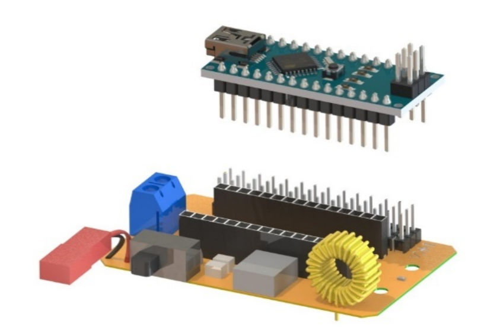

Step 2: Insert the battery to the battery cable.

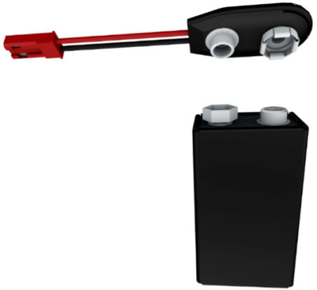

And connect the battery cable to the expansion board.

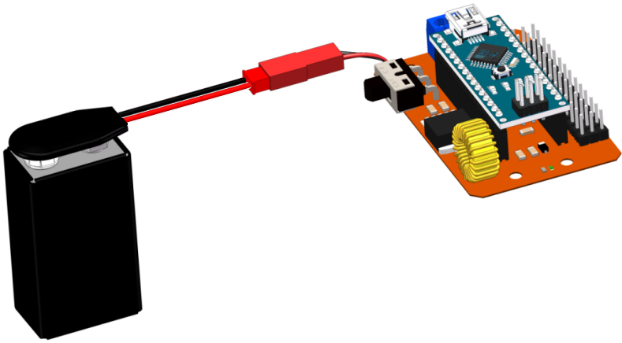

Step 3: Connect four servos to pin 9 to pin 12 of the expansion board.

.. note:: The yellow, red, and brown wires connect to Signal, VCC, and GND on the expansion board, respectively.

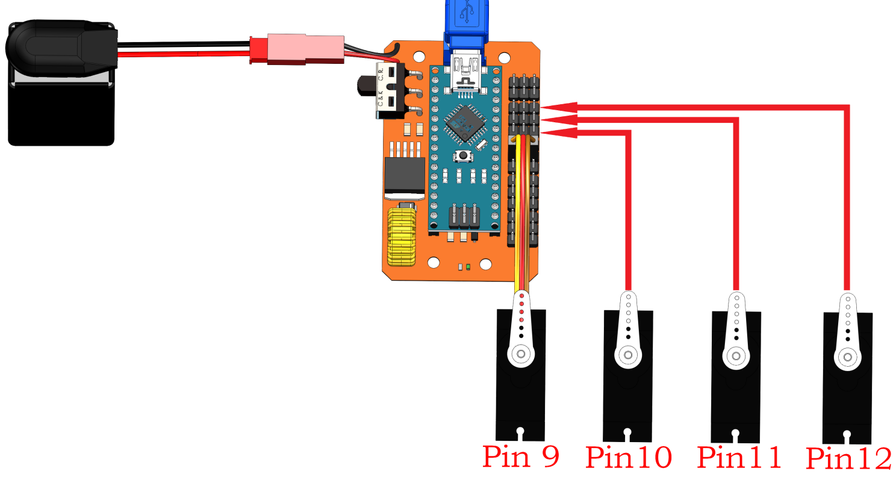

Step 4: Open the Test_robot.ino under this path of ``DIY_4-DOF_Robot_Kit_-_Sloth\Code\Test_robot``. 

Uncomment the line 16 (delete sign ``//`` to start the corresponding servo test code); 
the comment the line: ``//#define ULTRASONIC``.

.. note:: It is not recommended to uncomment both lines at the same time.

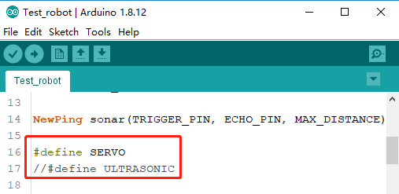

Step 5: Select the corresponding Board, Processor and Port.

* Board: Arduino Nano.
* Processor: ATmega328P. If the code cannot be uploaded successfully for a long time, it needs to be changed to ATmega328P (Old Bootloader).
* Port: Random allocation. The corresponding option can be determined by pulling out the USB cable and reconnecting the nano. Usually a combination of "COM + Numbers". 

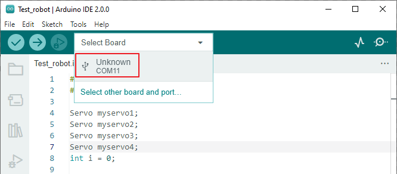

Step 6: Upload codes to SunFounder Nano board.

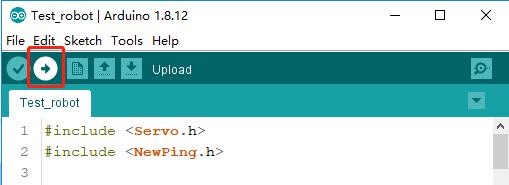

After waiting for a few seconds, the download process is successful. 
The following window will prompt “Done uploading”.

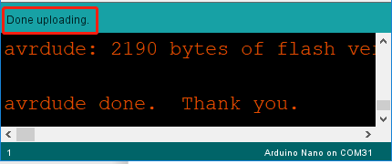

.. note:: If the code cannot be uploaded successfully for a long time, Processor needs to be changed to ATmega328P (Old Bootloader).

Step 7: Slide the power switch to ON. You will see the rocker arm rotates within 0-180 degrees, indicating the servo can work.

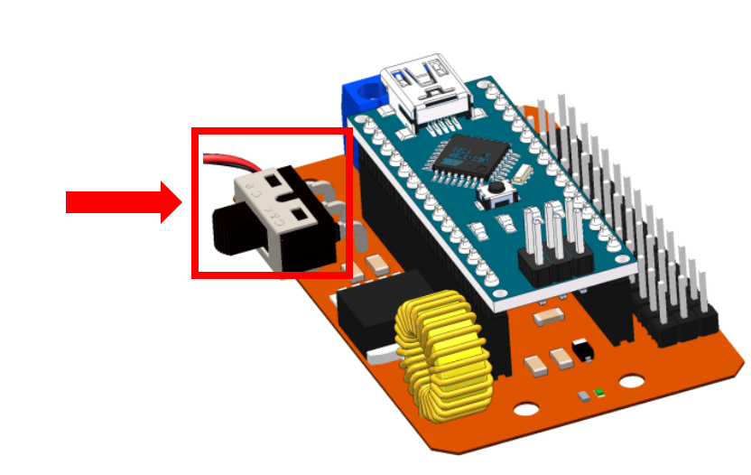

Test the Ultrasonic Module
--------------------------

1. Connect Ultrasonic module to Servo Control Board via 4-Pin Anti-reverse Cable.

.. image:: img/test_ultrasonic_1.png

2. Open the ``Test_robot.ino`` and select Board, Processor and Port.

3. Comment out line 16 by prefixing ``#define SERVO`` with ``//``; then uncomment ``#define ULTRASONIC``. 

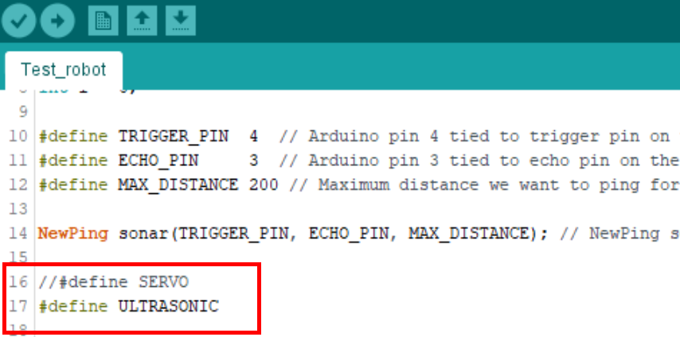

4. Open the serial monitor after uploading the code.

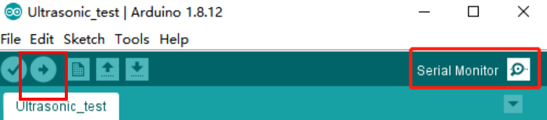

5. Set the baud rate to 115200 (started by line 25 ``serial.begin(115200)``).

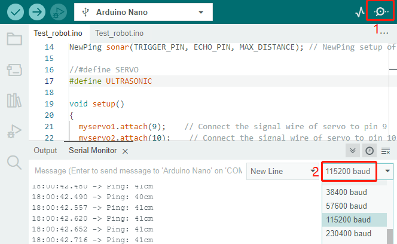

6. Turn the power switch to ON you can see the detected distance.

.. note:: The detection distance of ultrasonic module is 2-400cm, if the data is 0 or a few thousand, it means that it is invalid data need to be ignored.